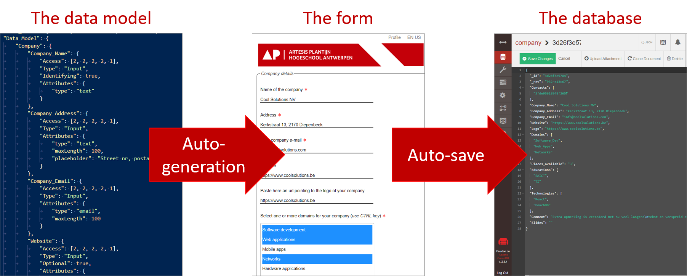
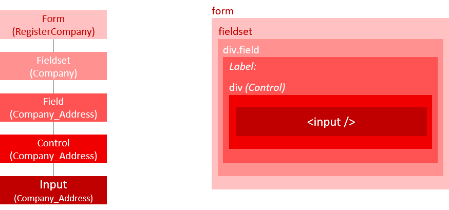
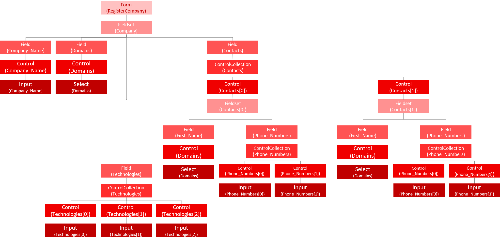
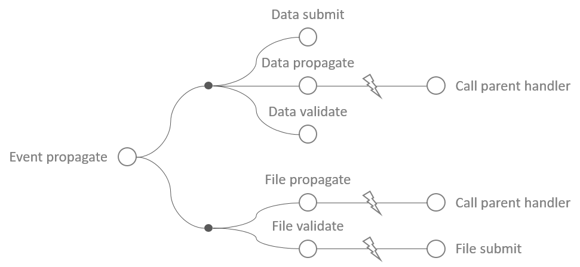

# Creating Auto-generated & Submission-Free Forms (React and PouchDB)

> *This article describes a way to create submission-free forms that are automatically generated from a JSON data model and that instantaneously synchronize to a (NoSQL) database. Submission-free forms are the user-friendly equivalent of regular forms. They lack a 'submit'-button so that the user can fill-out and review the form in any order.*

> *This article also describes 1. the use of a simple asynchronous message queue to handle database requests and 2. the use of a simple workflow-handler that allows to organize multiple operations in parallel or in series.*

## How it works



## Auto-generating Forms

Auto-generated forms allow for very loose data models that can evolve with time and require minimal maintenance. The SPOT (*Single Point of Truth*) of the data model is a JSON object stored in a separate file. Every entity ('database' in NoSQL) has fields defined for it and every field has properties:

```json
"Company": {
	"Company_Name": {
		"Access": [2, 2, 2, 2, 1],
		"Type": "Input",
		"Identifying": true,
		"Attributes": {
			"type": "text"
		}
	},
	[…],
	"Website": {
		"Access": [2, 2, 2, 2, 1],
		"Type": "Input",
		"Optional": true,
		"Attributes": {
			"type": "url",
			"maxLength": 255,
			"pattern": "https?://.*"
		}
	},
	[…],
	"Contacts": {
		"Access": [2, 2, 2, 2, 1],
		"Type": "User",
		"Label": "Contact",
		"Cardinality": [1, 10],
		"Singular": "Contact"
	},
	[…]
},
"User": {
	[…],
	"First_Name": {
		"Access": [1, 1, 1, 2, 1],
		"Identifying": true,
		"Type": "Input"
	},
	[…]
}
```

As an example, we have companies and users and a `Company` can have multiple `User`s (contacts). Here is a diagram representing these two entities.


The `Access`-properties define the role-dependent accessibility of the field. The `Type` property-entries correspond to the fields' data type and are linked to the type of control that will be used to render them: 

| Type               | Control                       |
|--------------------|-------------------------------|
| Input (type=*any*) | &lt;input type="*any*"/&gt;   |
| Select             | &lt;select /&gt;              |
| File               | &lt;input type="*file*" /&gt; |
| Text               | &lt;textarea /&gt;            |
| Entity             | &lt;fieldset /&gt;            |

Indeed, the `Type` property can also be used to create relations among  entities. For example see the `Contacts` field in the above data model, where the company `Contacts` refer to the `User` entity. Mind that, using the `Cardinality` key, one can indicate that a field consist of a collection of values and immediately define upper- and lower bounds for the collection size. This implementation also allows the developer to provide  attributes that are to be added to the controls directly.

> Note how The JSON data model allows to elegantly combine the data model with reference data, how meta-data can easily be attached inside the field definition and how easy it is to customize validation, lay-out and behavior. Here are some more fields to illustrate this point:
> ```json
> "Company_Address": {
>	"Access": [2, 2, 2, 2, 1],
>	"Type": "Input",
>	"Attributes": {
>		"type": "text",
>		"maxLength": 100,
>		"placeholder": "Street nr, postal City"
>	}
>},
>"Domains": {
>	"Access": [2, 2, 2, 2, 1],
>	"Type": "Select",
>	"List": [
>		"Software_Dev",
>		"Web_Apps",
>		"Mobile",
>		"Networks",
>		"Hardware",
>		"Virtual_Reality",
>		"IOT",
>		"Security",
>		"SAP",
>		"Big_Data"
>	],
>	"Attributes": { "multiple": true }
>},
>"Phone_Numbers": {
>	"Access": [2, 2, 2, 2, 2],
>	"Type": "Input",
>	"Cardinality": [1, 3],
>	"Singular": "Phone_Number"
>},
> ```

## Automatic Generation of Forms

We have the data as JavaScript object, so how do we generate a form out of it? Let us start by visualizing a form as a layered structure:



Note that each layer is represented by a [React Component](https://reactjs.org/) and has a specific function. The top-layer is the `Form`, which is a wrapper around the HTML `<form />` element. The next layer is the `FieldSet` component, again a wrapper. This layer will hold the information for one entity (in the above figure, it is the `Company`). The `Fieldset` will be made responsible for data-binding as we will discuss below in more detail. A `FieldSet` on its turn will contain many `Field` components, each of which contains a field label, an error-message placeholder ans the actual `Control` component. Finally, the `Control` component will enclose one of the different input fields.

In fact, the situation is a bit more complex than that. In reality, the Form-layers can be regarded as a tree-like structure because `Field`s and `Control`s can on their turn contain new `FieldSet`s or `ControlCollection`s (i.e. control arrays), etc…. Let us turn to our example with a partial representation of a company containing 2 contacts:



As the form generation is a recursive process, there is no limit to the depth and complexity of your form, except maybe the patience of the user who fills out the form. The code to read the data model and turn it into `Field` components is surprisingly simple. From the somewhat simplified `render` function of the `FieldSet` component:

```js
const { Data } = this.state;
const { Entity } = this.props.Context;

// Using the single-point of truth data model as a template, create
//  recursively the necessary components. Each entity definition is being
//  represented by the Field_Object variable. This object contains all the
//  needed information to render the corresponding control as well as
//  determining its behavior. This object is being carried downstream all
//  the way.
const Fields = Object.entries(Dat.Data_Model[Entity]).map(
	([Field_Id, Field_Object]) => {
		let Field_Context = cloneDeep(Context);

		Field_Context.Field_Id = Field_Id;
		Field_Context.Field_Object = Field_Object;
		Field_Context.Local_Read_Only = Access === Access_Levels.Read_Only;

		return (
			<Field
				key={Field_Id}
				Data={Data[Field_Id]}
				Context={Field_Context}
			/>
		);
	}
);

return (
	<fieldset>
		<legend>{T(Entity)}</legend>
		{Fields}
	</fieldset>
);
```

The data model for a given entity is being read from `Dat`, a generic data object that also contains information other than the data model. The field-wise information is being transferred downwards through `props.Context.Field_Object`. `Data` is taken from the local `state` where it had been previously populated. If a field does not exist on the `Data` object, `Data[Field_Id]` remains `undefined`. Downward components take this possibility into consideration so that when a field is empty, it can be filled out and when it is pre-completed, the field can be updated instead. How is this recursive, you might think? Well, whenever the `Field` component encounters a type that corresponds to an entity name, it simply renders a child `FieldSet` and we come full circle:

```js
if (Object.keys(Dat.Data_Model).includes(Field_Object.Type)) {
	Sub_Component = (
		<FieldSet
			Context={Context}
			Data={Data}
			Data_Pass={this.Data_Receive}
			Parent_Handler={this.Handler}
			Label={Field_Object.Label}
			Roles={[Form_Roles.Data_Binder, Form_Roles.Data_Propagator]}
		/>
	);
}
```

## Form Roles

In order to manage the complexity of the hierarchical forms, I devised a simple ruling system based on 'form roles'. Simply put, these roles tell the underlying components how to behave. For example, below is a simplified branch of the component tree with the respective roles:


In this generic branch we see that the `Fieldset` is responsible for getting the data from the database (one-way data binding) whereas the `Control` component is responsible for updating the data to the database (Data_Submitter). Data flows downstream through the props and flows back up through the state. The lowest level or 'leave' of the branch is where the user input generates the data (Data_Generator) which is then being 'propagated' upwards. Mind that the roles can would generally differ dependeing on the position of a given component within a tree. For example, the topmost `FieldSet` does not need to propagate data upwards whereas the downstream `FieldSet`s (such as `Contacts[0]` and `Contacts[1]` in the above tree) do.

With this, it becomes possible to orchestrates all necessary form operations. As an example, I show you how a parent component collects data from a child/downstream component differently depending on its role as a data merger:

```js
const { Data } = this.state;
const { Roles } = this.props;

let New_Data = null;

if (Roles.includes(Form_Roles.Data_Merger)) {
	if (Number.isInteger(iChild_Id)) {
		New_Data = Data;
		New_Data[iChild_Id] = iNew_Data;
	} else {
		New_Data = { ...Data, ...{ [iChild_Id]: iNew_Data } };
	}
} else {
	New_Data = iNew_Data;
}
```

Note that in our setting only a `ControlCollection`s (as we encountered with the collection of technologies with integer-valued indices) and `FieldSet`s can function as `Data_Merger`s. Also note the use of the [spread syntax](https://developer.mozilla.org/en-US/docs/Web/JavaScript/Reference/Operators/Spread_syntax) to perform the merge. Finally, notice how I try to avoid bare strings in my code by making use of string-valued enumerations:

```js
export const Form_Roles = Object.freeze({
	Data_Binder: "Data_Binder",
	Data_Generator: "Data_Generator",
	Data_Merger: "Data_Merger",
	Data_Propagator: "Data_Propagator",
	Data_Submitter: "Data_Submitter",
	Data_Validator: "Data_Validator",

	Error_Reporter: "Error_Reporter",
	Error_Propagator: "Error_Propagator",

	Event_Propagator:"Event_Propagator",

	File_Generator: "File_Generator",
	File_Propagator: "File_Propagator",
	File_Submitter: "File_Submitter",

	Global_Read_Only_Reporter: "_Global_Read_Only_Reporter",
	Local_Read_Only_Reporter: "Local_Read_Only_Reporter"
});
```

I chose to organize the roles by the subject (Data, Error, Event, File or State) but that is of course to be customized for your particular needs.

## Wrappers and Logging

In order to avoid repetitive code, I had the `Form` component and all of its descendants inherit from a wrapper around the React `Component` called the `FormComponent`. For example:

```js
class ControlCollection extends FormComponent {
	[…]
}

class FormComponent extends WrapperComponent {
	[…]
}
```

There is one more layer of wrapping paper added here: the `WrapperComponent`. This wrapper is also for non-form component and serves to inject simple logging capability:

```js
class WrapperComponent extends Component {
	Log = (iMessage, iType = Message_Types.Info) => {
		const { Verbose } = this.props.Context;
		const Message = this.constructor.name + ": " + iMessage;

		if (!Verbose) return;

		switch (iType) {
			case Message_Types.Info:
				console.log(Message);
				break;

			case Message_Types.Error:
				console.error(Message);
				break;

			case Message_Types.Warning:
				console.warn(Message);
				break;

			default:
				break;
		}
	};
}

export default WrapperComponent;
```

Notice how the use of `this.constructor.name` elegantly allows to identify which Component is calling. Since the incoming argument `iMessage` generally starts with the name of the caller function, Log statements tend to come up nice a orderly so that the developer can follow the asynchronous chain of events:

```log
[…]
Form: render: Company: 3d26f3e5-------------8caa24006c8b
FieldSet: Get_Doc: Company: 3d26f3e5-------------aa24006c8b
DB: Check_DB: Creating DB for entity Company
DB: Dispatch: Handling operation on Company
App: render: Starting application.
Action: render: Adding action Stage_Event
RegisterCompany: render
DB: On_Get_Success: Returned successfully from Get operation.
[…]
```

Thanks to the inheritance and dependency-injection I was able to keep the size of the project described in this article to a minimum, without hindering readability and manageability. The components together take op `42kB` (`96kB` on disk), the data model `21kb` (`28kB` on disk), the logic and DB connector `11kB` (`16kB` on disk) and the CSS styling `7kB` (`44kB` on disk).

## WorkFlow Handler

[Promises](https://developer.mozilla.org/nl/docs/Web/JavaScript/Reference/Global_Objects/Promise) are a great invention, but at some point I wanted more. The goal was to define a workflow consisting of a set of form operations, some of which to run synchronously, others to run asynchronously. For example I wanted to be able to execute the following form operations



Operations in the above diagram that need to run asynchronously are ordered horizontally. Operations that can be executed synchronously are stacked vertically. So, in the main 'thread', operations are ordered `Event_Propagate`, `Data_Submit`, `Data_Propagate`, `Data_Validate`, `File_Propagate` and `File_Validate`. Here is the workflow definition:

```js
const Default_Work_Flow = [
	this.Event_Propagate,
	{
		B1: {
			B1A: this.Data_Submit,
			B1B: [this.Data_Propagate, this.Handle_Parent],
			B1C: this.Data_Validate
		},
		B2: {
			B2A: [this.File_Propagate, this.Handle_Parent],
			B2B: [this.File_Validate, this.File_Submit]
		}
	}
];
```

Mind that the workflow definition could have been simplified as the `B1` and `B2` nodes are superfluous and only there to separate file operations (called *attachments* in CouchDB) from data operations. The actual handler is this recursive function:

```js
Handler = (iWork_Flow = null) => {
	// If the provided workflow is a simple function then execute it
	if (typeof iWork_Flow === "function") {
		iWork_Flow();

	// If the provided workflow is an array
	} else if (Array.isArray(iWork_Flow)) {
		if (iWork_Flow.length === 0) return;

		// Run the next function and run the rest of the workflow only when it
		// is finished. Callback's are being sent to the function as function
		// argument the traditional way as it allows the function to decided how
		// and when to handle it.
		let Next = iWork_Flow.shift();

		if (typeof Next === "function") {
			Next(() => {
				this.Handler(iWork_Flow);
			});
		} else {
			this.Handler(Next);
		}

	// If the provided workflow is an object, run it elements synchronously
	} else if (iWork_Flow != null) {
		Object.values(iWork_Flow).forEach(Work_Flow_Item => {
			this.Handler(Work_Flow_Item);
		});
	}
};
```

## The Database Connector

The database here was a [PouchDb](https://pouchdb.com/) connector to a CouchDB NoSQL storage facility. In order to avoid concurrency issues I devised a small queue-based dispatcher that pops the next DB operation and directs it to the proper function. This dispatcher resides in a custom DB-connector:

```js
export class DB {
	constructor(iAddress, iVerbose) {
		this.Queue = [];
		this.DBs = {};
		this.Docs = {};
		this.Verbose = iVerbose;
		this.Current_Operation = {};
		this.State = Server_States.Local;
		this.Address = iAddress;
		this.Index = 0;
	}
	[…]
	Dispatch = () => {
		if (this.Queue.length === 0 || this.State === Server_States.Remote) return;

		this.State = Server_States.Remote;
		this.Current_Operation = this.Queue.pop();

		const { Func, Entity, Operation_Id } = this.Current_Operation;

		Func();
	};
	[…]
}
```

Lets go over the properties one-by-one. The `Queue` object stores the DB operations. The `DBs` object stores the PouchDB connectors. In NoSQL a connector typically links to one entity only (confusingly called a '*database*' in CouchDB terminology), so there is a connector for each entity. The records in the database are called '*Documents*', by the way. Each document in versioned separately and updating a document requires the version (so-called *revision identifier*) of that particular document. Instead of calling the database for the latest document version before each update operation, I decided here to store them temporarily in the `Docs` variable. In case you're wondering about performance, here, remember that if your application is hauling thousands of documents over the wire, there is probably something wrong in your design. The `Verbose` variable tells the DB connector whether it is OK to log messages (DB has its separate logging system). The `Current_Operation` variable stores the DB operation currently being executed. The `State` variable is a little bit superfluous. It tells the dispatcher wether a DB operation is currently being executed (`Remote`) or not (`Local`). Finally, the `Address` stores the location of the CouchDB database and `Index` counts the number of DB operations to allow for internal ID's to be generated.

A DB operation is being coded as a simple object that keeps the function to dispatch to and all the necessary arguments:

```js
Add_Operation = iOperation => {
	iOperation.Operation_Id = this.Index++;
	this.Queue.push(iOperation);
};

Put_Doc = (iEntity, iEntity_Id, iField_Id, iData, iOn_Success, iOn_Error) => {
	this.Add_Operation({
		Func: this.Put_Doc_Inner,
		Entity: iEntity,
		Entity_Id: iEntity_Id,
		Field_Id: iField_Id,
		Data: iData,
		On_Success: iOn_Success,
		On_Error: iOn_Error
	});

	this.Dispatch();
};
```

Here, 'put' stands for update. The function `Put_Doc_Inner` is the one being called (later) by the dispatcher and it looks like this:

```js
Put_Doc_Inner = () => {
	const Operation = this.Current_Operation;
	const { Entity, Entity_Id, Field_Id, Data } = Operation;

	this.Docs[Entity + Entity_Id][Field_Id] = Data;

	this.DBs[Entity].put(this.Docs[Entity + Entity_Id])
		.then(this.On_Put_Success)
		.catch(this.On_Put_Error);
};
```

Notice how `Data` holds the field information such as `221B Baker Street, London, UK` and `Field_Id` holds the field name such as `Company_Address`. The `put` function belongs to PouchDB and prepares and executes the the API call to the CouchDB. Upon a succesfull response from CouchDB, a callback internal to the `DB` object is being called:

```js
On_Put_Success = iResponse => {
	const Operation = this.Current_Operation;
	const { Entity, Entity_Id } = Operation;

	if (Operation.On_Success) Operation.On_Success(iResponse);

	this.Current_Operation = null;
	this.State = Server_States.Local;

	this.Docs[Entity + Entity_Id]["_rev"] = iResponse.rev;

	this.Dispatch();
};
```

The statement `Operation.On_Success(iResponse)` returns the control to whoever called the DB to perform this particular operation. Notice here how the new revision identifier returned by CouchDB is being copied to the internal `Docs` storage. Finally, in order to avoid the queue waiting forever for a CouchDB call gone rogue, I included a little safety line inside the `Dispatch`er:

```js
setTimeout(this.Reset, 1000, Operation_Id);
```

## Multi-Language Support

I was keen to support multiple languages from the start. Actually, almost all strings in the application represent the keys to some dictionary entry. You simply need to send your key to a translator, here represented by the function `T()`:

```js
const Label = T("Field_" + Field_Id);
const Description = T("Field_" + Field_Id + "_Desc", T("Enter_Value"));
```

The dictionary itself is stored as JSON object so that other team members can easily edit it without the need of special IT skills:

```json
"Field_Domains": {
	"nl-be": "MD:Kies één of meerdere domeinen waarin uw bedrijf actief is (*gebruik CTRL toets*)",
	"en-us": "MD:Select one or more domains for your company (*use CTRL key*)"
},
"Field_Domains_Desc": {
	"nl-be": "Kies één of meerdere domeinen die het dichts aanleunen bij die van uw bedrijf (*gebruik CTRL toets*)",
	"en-us": "Select one or more domains that matches the company's domains as closely as possible (*use CTRL key*)"
},
```

Obviously, one can easily add as many languages for as many terms as desired.

> Note that the `MD:`-prefix above allows for [Markdown](https://nl.wikipedia.org/wiki/Markdown) notation so that one can easily add text styling without forming a security threat.

The translation function `T()` looks like this:

```js

export function T(iKey, iDefault = null, iReplace = null, iLanguage = lang) {
	if (!Dict[iKey]) {
		return iDefault || iKey;
	}

	let Translation = Dict[iKey][iLanguage] || iDefault || iKey;

	if (iReplace) {
		Object.entries(iReplace).forEach(([From, To]) => {
			Translation = Translation.replace("{" + From + "}", To);
		});
	}

	if (Translation.substring(0, 3) === "MD:") {
		Translation = (
			<ReactMarkdown source={Translation.substr(3, Translation.length)} />
		);
	}

	return Translation;
}
```

The function allows for a fallback value in case the dictionary key is not found and it allows for template replacements to be performed immediately after the look-up operation. As an example, suppose you want an error message to contain the maximum allowed cardinality of a field:

```json
"Exceeding_Cardinality": {
	"nl-be": "Te veel elementen, je mag maximaal {Max} elementen hebben.",
	"en-us": "Too many item, you can have at most {Max} items."
},
```

```js
let Error_Message = T(
	"Exceeding_Cardinality", null,
	{ Max: Field_Object.Cardinality[1] }
);
```

> Note: I decided to keep the current language in a custom `Context` variable so that with one click on the top-right button all text-elements are instantaneously being translated.
> 
>  

## Feedback

That's it. Please, let me know if you find errors or you see ways to improve on this concept or if you have other queries.
