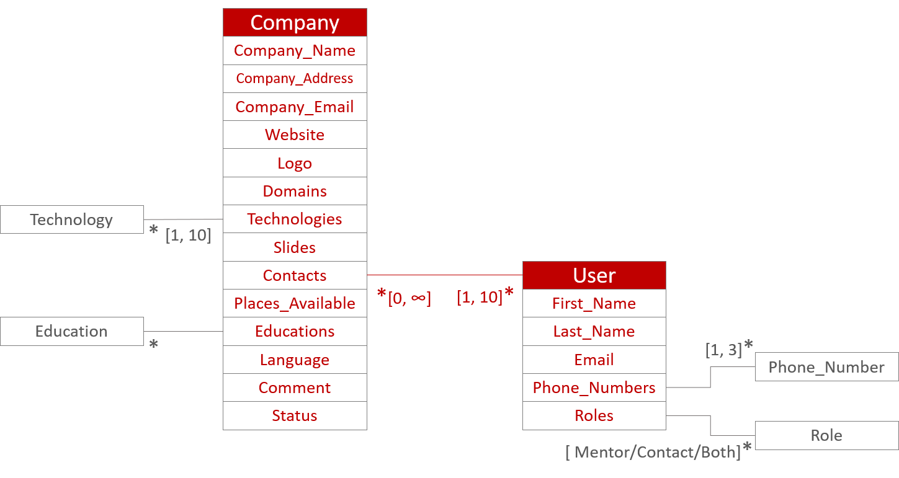
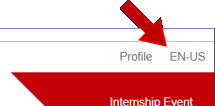

# Creating Auto-generated & Submission-Free Forms (React and PouchDB)

> *This article describes a way to create submission-free forms that are automatically generated from a JSON data model and that instantaneously synchronize to a (NoSQL) database. Submission-free forms are the user-friendly equivalent of regular forms. They lack a 'submit'-button so that the user can fill-out and review the form in any order.*

> *This article also describes 1. the use of a simple asynchronous message queue to handle database requests and 2. the use of a simple workflow-handler that allows to organize multiple operations in parallel or in series.*

## How it works


## Auto-generating Forms

Auto-generated forms allow for very loose data models that can evolve with time and require minimal maintenance. The SPOT (*Single Point of Truth*) of the data model is a JSON object stored in a separate file. Every entity ('database' in NoSQL) has fields defined for it and every field has properties:

```json
"Company": {
	"Company_Name": {
		"Access": [2, 2, 2, 2, 1],
		"Type": "Input",
		"Identifying": true,
		"Attributes": {
			"type": "text"
		}
	},
	[…],
	"Website": {
		"Access": [2, 2, 2, 2, 1],
		"Type": "Input",
		"Optional": true,
		"Attributes": {
			"type": "url",
			"maxLength": 255,
			"pattern": "https?://.*"
		}
	},
	[…],
	"Contacts": {
		"Access": [2, 2, 2, 2, 1],
		"Type": "User",
		"Label": "Contact",
		"Cardinality": [1, 10],
		"Singular": "Contact"
	},
	[…]
},
"User": {
	[…],
	"First_Name": {
		"Access": [1, 1, 1, 2, 1],
		"Identifying": true,
		"Type": "Input"
	},
	[…]
}
```

As an example, we have companies and users and a `Company` can have multiple `User`s (contacts). Here is a diagram representing these two entities.



The `Access`-properties define the role-dependent accessibility of the field. The `Type` property-entries correspond to the fields' data type and are linked to the type of control that will be used to render them: 

| Type  | Control         |
|-------|-----------------|
| Input (type=*any*)| &lt;input type="*any*"/&gt; |
| Select | &lt;select /&gt; |
| File | &lt;input type="*file*" /&gt; |
| Text | &lt;textarea /&gt; |
| Entity | &lt;fieldset /&gt; |

Indeed, the `Type` property can also be used to create relations among  entities. For example see the `Contacts` field in the above data model, where the company `Contacts` refer to the `User` entity. Mind that, using the `Cardinality` key, one can indicate that a field consist of a collection of values and immediately define upper- and lower bounds for the collection size. This implementation also allows the developer to provide  attributes that are to be added to the controls directly.

> Note how The JSON data model allows to elegantly combine the data model with reference data, how meta-data can easily be attached inside the field definition and how easy it is to customize validation, lay-out and behavior. Here are some more fields to illustrate this point:
> ```json
> "Company_Address": {
>	"Access": [2, 2, 2, 2, 1],
>	"Type": "Input",
>	"Attributes": {
>		"type": "text",
>		"maxLength": 100,
>		"placeholder": "Street nr, postal City"
>	}
>},
>"Domains": {
>	"Access": [2, 2, 2, 2, 1],
>	"Type": "Select",
>	"List": [
>		"Software_Dev",
>		"Web_Apps",
>		"Mobile",
>		"Networks",
>		"Hardware",
>		"Virtual_Reality",
>		"IOT",
>		"Security",
>		"SAP",
>		"Big_Data"
>	],
>	"Attributes": { "multiple": true }
>},
>"Phone_Numbers": {
>	"Access": [2, 2, 2, 2, 2],
>	"Type": "Input",
>	"Cardinality": [1, 3],
>	"Singular": "Phone_Number"
>},
> ```

## Automatic Generation of Forms

We have the data as JavaScript object, so how do we generate a form out of it? Let us start by visualizing a form as a layered structure:


Note that each layer is represented by a [React Component](https://reactjs.org/) and has a specific function. The top-layer is the `Form`, which is a wrapper around the HTML `<form />` element. The next layer is the `FieldSet` component, again a wrapper. This layer will hold the information for one entity (in the above figure, it is the `Company`). The `Fieldset` will be made responsible for data-binding as we will discuss below in more detail. A `FieldSet` on its turn will contain many `Field` components, each of which contains a field label, an error-message placeholder ans the actual `Control` component. Finally, the `Control` component will enclose one of the different input fields.

In fact, the situation is a bit more complex than that. In reality, the Form-layers can be regarded as a tree-like structure because `Field`s and `Control`s can on their turn contain new `FieldSet`s or `ControlCollection`s (i.e. control arrays), etc…. Let us turn to our example with a partial representation of a company containing 2 contacts:


As the form generation is a recursive process, there is no limit to the depth and complexity of your form, except maybe the patience of the user who fills out the form.

## Form Roles

In order to manage the complexity of the hierarchical forms, I devised a simple ruling system based on 'form roles'. Simply put, these are roles that certain layers in the form hierarchy are given and that tell the underlying components what to do. For example, below is a simplified branch of the component tree with the respective roles:


## Multi-Language Support

I was keen to support multiple languages from the start. Actually, almost all strings in the application represent the keys to some dictionary entry. You simply need to send your key to a translator, here represented by the function `T()`:

```js
const Label = T("Field_" + Field_Id);
const Description = T("Field_" + Field_Id + "_Desc", T("Enter_Value"));
```

The dictionary itself is stored as JSON object so that other team members can easily edit it without the need of special IT skills:


```json
"Field_Domains": {
	"nl-be": "MD:Kies één of meerdere domeinen waarin uw bedrijf actief is (*gebruik CTRL toets*)",
	"en-us": "MD:Select one or more domains for your company (*use CTRL key*)"
},
"Field_Domains_Desc": {
	"nl-be": "Kies één of meerdere domeinen die het dichts aanleunen bij die van uw bedrijf (*gebruik CTRL toets*)",
	"en-us": "Select one or more domains that matches the company's domains as closely as possible (*use CTRL key*)"
},
```

Obviously, one can easily add as many languages for as many terms as desired.

> Note that the `MD:`-prefix above allows for [Markdown](https://nl.wikipedia.org/wiki/Markdown) notation so that one can easily add text styling without forming a security threat.

The translation function `T()` looks like this:

```js

export function T(iKey, iDefault = null, iReplace = null, iLanguage = lang) {
	if (!Dict[iKey]) {
		return iDefault || iKey;
	}

	let Translation = Dict[iKey][iLanguage] || iDefault || iKey;

	if (iReplace) {
		Object.entries(iReplace).forEach(([From, To]) => {
			Translation = Translation.replace("{" + From + "}", To);
		});
	}

	if (Translation.substring(0, 3) === "MD:") {
		Translation = (
			<ReactMarkdown source={Translation.substr(3, Translation.length)} />
		);
	}

	return Translation;
}
```

The function allows for a fallback value in case the dictionary key is not found and it allows for template replacements to be performed immediately after the look-up operation. As an example, suppose you want an error message to contain the maximum allowed cardinality of a field:

```json
"Exceeding_Cardinality": {
	"nl-be": "Te veel elementen, je mag maximaal {Max} elementen hebben.",
	"en-us": "Too many item, you can have at most {Max} items."
},
```

```js
let Error_Message = T(
	"Exceeding_Cardinality", null,
	{ Max: Field_Object.Cardinality[1] }
);
```

> Note: I decided to keep the current language in a custom `Context` variable so that with one click on the top-right button all text-elements are instantaneously being translated.
> 
>  


